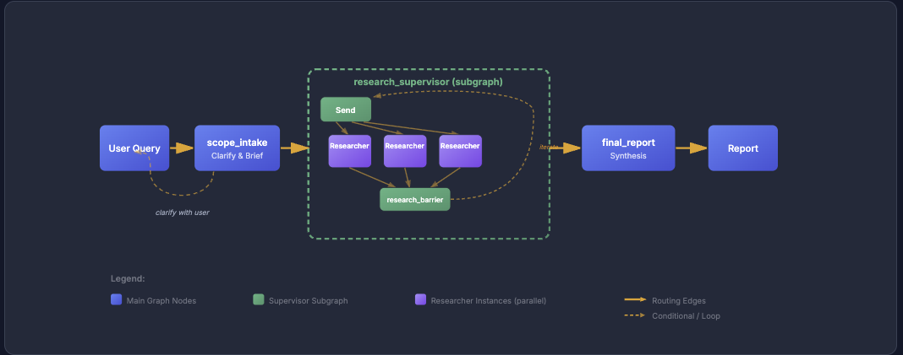

# Deep Research

Deep Research is a LangGraph-based multi-agent system that clarifies scope when needed, runs focused web research in parallel, and returns a synthesized answer with citations.



## Setup

Requirements:
- Python 3.11+
- LLM API key (for the default OpenAI model, set `OPENAI_API_KEY`)
- Search API key (default provider is Exa, set `EXA_API_KEY`)

Install and configure:

```bash
git clone https://github.com/Hmbown/deepresearch.git
cd deepresearch

python3 -m venv .venv
source .venv/bin/activate
pip install -e .

cp .env.example .env
```

Run preflight and a query:

```bash
deepresearch --preflight
deepresearch "Your research question"
```

For full environment/config options, see `.env.example`.

## Architecture

The runtime uses one canonical path: `scope_intake -> research_supervisor -> final_report_generation` ([`src/deepresearch/graph.py`](src/deepresearch/graph.py)). Intake decides whether clarification is needed, the supervisor delegates independent research tracks (parallel where possible), and researcher outputs are synthesized into a final report with inline citations and source URLs.

## Design Rationale

See [DESIGN.md](design.md) for design rationale.
