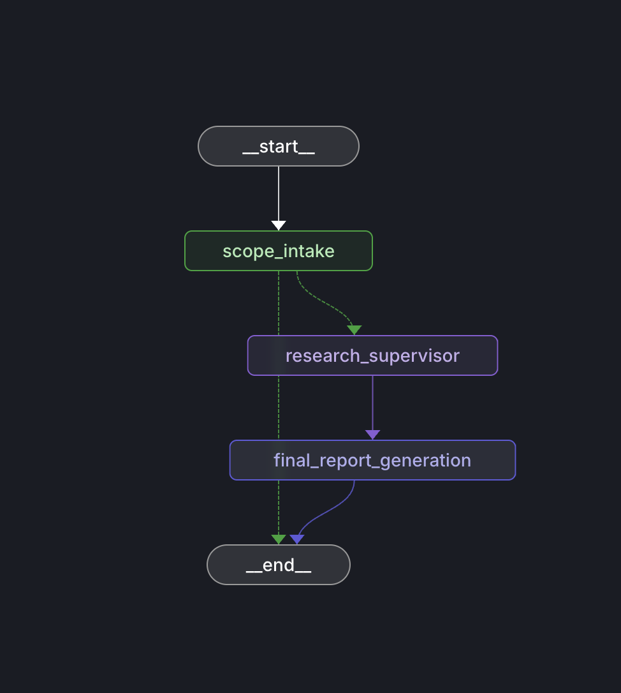

# Deep Research

Multi-agent research system built on [LangGraph](https://github.com/langchain-ai/langgraph). Takes a research question, optionally asks one clarifying question to tighten scope, dispatches multiple independent research tasks in parallel, and synthesizes a cited report with inline citations and source URLs.


## How It Works

**Scope intake** reads the question and either proceeds directly or asks one clarifying question to narrow scope. It generates a research brief that seeds the supervisor. On follow-up turns, it detects topic shifts and re-clarifies when the conversation diverges.

**Supervisor** breaks the research brief into independent focused units and dispatches them via `ConductResearch` tool calls. Multiple calls in one turn execute in parallel (up to `MAX_CONCURRENT_RESEARCH_UNITS`, default 6). The supervisor enforces an evidence quality gate: it rejects `ResearchComplete` if collected evidence is insufficient (not enough sourced claims or too few source domains) and forces additional research iterations.

**Researcher agents** are each a `create_deep_agent()` instance from the [deepagents](https://github.com/langchain-ai/deepagents) library with built-in middleware for context window summarization, large result eviction, and malformed tool call recovery. Each researcher has `search_web`, `fetch_url`, and `think_tool`. After completion, output is post-processed via `extract_research_from_messages()` to produce compressed notes, raw notes, and a typed evidence ledger (`EvidenceRecord` with claim, source URLs, confidence score, contradiction/uncertainty notes).

**Final report** synthesizes all research into a structured response with section headings, inline citations (`[1]`, `[2]`) tied to specific claims, a sources section mapping each citation to URLs, and explicit notes on uncertainty or contradictory findings.

## Prerequisites

- Python 3.11 or later
- An OpenAI API key (or key for any provider supported by `init_chat_model()`)
- A search provider API key (Exa or Tavily)

```bash
python3 --version  # must be 3.11+
```

## Quickstart

```bash
git clone https://github.com/Hmbown/deepresearch.git
cd deepresearch

python3 -m venv .venv
source .venv/bin/activate    # Linux/macOS
# .venv\Scripts\activate     # Windows

pip install -e .

cp .env.example .env
```

Edit `.env` and set your keys. The minimum viable configuration requires an LLM key and a search provider key:

```
OPENAI_API_KEY=sk-...
EXA_API_KEY=...              # default search provider
```

Or if using Tavily:

```
OPENAI_API_KEY=sk-...
SEARCH_PROVIDER=tavily
TAVILY_API_KEY=tvly-...
```

Run the preflight check to validate your setup:

```bash
python -m deepresearch.cli --preflight
```

## Usage

The graph is a standard LangGraph application. You can run it anywhere LangGraph runs: Studio, LangServe, programmatically, or from the included CLI.

### LangGraph Studio (recommended for development)

```bash
uvx --refresh --from "langgraph-cli[inmem]" --with-editable . --python 3.11 langgraph dev --allow-blocking
```

Opens the Studio UI with visual graph traces, state inspection, and step-through debugging. The repo includes a `langgraph.json` that configures the graph automatically.

### Programmatic

```python
import asyncio
from deepresearch.graph import app

async def main():
    result = await app.ainvoke(
        {"messages": [{"role": "user", "content": "Your research question"}]},
        config={"configurable": {"thread_id": "my-thread"}},
    )
    print(result["messages"][-1].content)

asyncio.run(main())
```

### CLI

A terminal interface with live progress display is included for quick runs and interactive sessions:

```bash
deepresearch "What are the latest advances in quantum error correction?"

# or via module
python -m deepresearch.cli "Compare retrieval strategies for production RAG systems"

# interactive multi-turn mode
deepresearch
```

## Configuration

### Models

Any provider supported by `init_chat_model()`. Configure with `provider:model` strings.

| Variable | Default | Role |
|---|---|---|
| `ORCHESTRATOR_MODEL` | `openai:gpt-5.2` | Supervisor planning, note compression, final report |
| `SUBAGENT_MODEL` | `openai:gpt-5.2` | Delegated research execution |

### Search

| Variable | Default | Notes |
|---|---|---|
| `SEARCH_PROVIDER` | `exa` | `exa` or `tavily`. Set to `none` to disable web search (local development and testing only). |
| `EXA_API_KEY` | -- | Required when `SEARCH_PROVIDER=exa` |
| `TAVILY_API_KEY` | -- | Required when `SEARCH_PROVIDER=tavily` |

### OpenAI Responses API

OpenAI models use the Responses API by default. Non-OpenAI providers are unaffected.

| Variable | Default | Description |
|---|---|---|
| `OPENAI_USE_RESPONSES_API` | `true` | Use Responses API for OpenAI models |
| `OPENAI_OUTPUT_VERSION` | `responses/v1` | Output version for Responses API |
| `OPENAI_USE_PREVIOUS_RESPONSE_ID` | `false` | Use `previous_response_id` compaction |

To opt out and force Chat Completions behavior:

```
OPENAI_USE_RESPONSES_API=false
```

### Runtime Knobs

| Variable | Default | Description |
|---|---|---|
| `MAX_CONCURRENT_RESEARCH_UNITS` | `6` | Parallel researcher invocations per supervisor step |
| `MAX_RESEARCHER_ITERATIONS` | `16` | Total research units the supervisor can dispatch |
| `MAX_REACT_TOOL_CALLS` | `20` | Hard cap on tool calls per researcher invocation |
| `RESEARCHER_SEARCH_BUDGET` | `8` | Soft search budget hint per delegated research unit |
| `SUPERVISOR_NOTES_MAX_BULLETS` | `20` | Max compressed note bullets retained per research unit |
| `SUPERVISOR_NOTES_WORD_BUDGET` | `500` | Word budget for compressed supervisor notes |
| `SUPERVISOR_FINAL_REPORT_MAX_SECTIONS` | `12` | Max section count hint for final report |
| `ENABLE_RUNTIME_EVENT_LOGS` | `false` | Structured runtime event logging |
| `MAX_STRUCTURED_OUTPUT_RETRIES` | `3` | Bounded retries for structured-output LLM calls |

### Evaluations

| Variable | Default | Description |
|---|---|---|
| `ENABLE_ONLINE_EVALS` | `false` | Auto-attach LLM-as-judge eval callback to CLI runs |
| `EVAL_MODEL` | `openai:gpt-4.1-mini` | Model used for eval judge scoring |

See `.env.example` for the full set of options.

## Evidence Tracking

Every claim produced by a researcher is tracked as an `EvidenceRecord`:

```python
class EvidenceRecord(BaseModel):
    claim: str                              # atomic factual claim
    source_urls: list[str]                  # URLs supporting the claim
    confidence: float                       # estimate in [0, 1]
    contradiction_or_uncertainty: str | None # noted conflicts or gaps
```

The evidence ledger flows through the full pipeline. The supervisor quality gate uses it to decide whether enough evidence has been collected. The final report synthesis uses it to generate inline citations and uncertainty notes.

## Multi-turn Usage

The agent supports conversational follow-ups. Reuse the same `thread_id` across invocations:

```python
import asyncio
from deepresearch.graph import app

async def main():
    config = {"configurable": {"thread_id": "demo-thread"}}
    for question in [
        "Research the current state of nuclear fusion energy.",
        "Focus specifically on private sector investments since 2023.",
        "Now compare the leading companies by funding raised.",
    ]:
        result = await app.ainvoke(
            {"messages": [{"role": "user", "content": question}]},
            config=config,
        )
        print(result["messages"][-1].content)

asyncio.run(main())
```

The agent detects whether a follow-up is a continuation or a topic shift. Continuations trigger a new research cycle on the same scope. Topic shifts reset state and re-run intake.



## Output Format

Reports are returned directly in chat. Each report includes:

- Section headings organizing findings by theme
- Inline citations (`[1]`, `[2]`) tied to specific claims
- A Sources section mapping each citation number to URLs
- Explicit notes on uncertainty, contradictory findings, or evidence gaps

## Project Structure

```
src/deepresearch/
  graph.py                  # Main LangGraph runtime assembly (build_app, exported app)
  researcher_subgraph.py    # Deep agent researcher + evidence extraction
  supervisor_subgraph.py    # Supervisor loop with parallel dispatch and quality gate
  intake.py                 # Scope intake (clarification decision + brief synthesis)
  report.py                 # Final report synthesis with citation generation
  state.py                  # Shared state models (EvidenceRecord, ResearchState, etc.)
  nodes.py                  # Research tools (search_web, fetch_url, think_tool)
  prompts.py                # All prompt templates
  config.py                 # Model, search, and runtime configuration
  env.py                    # Environment bootstrap and preflight checks
  runtime_utils.py          # Runnable invocation helpers shared across graph modules
  cli.py                    # CLI entry point and interactive mode
  message_utils.py          # Message content extraction helpers
  evals/                    # Online LLM-as-judge evaluation framework
    evaluators.py           # Answer quality, process quality, composite scoring
    callback.py             # LangSmith callback attachment
    prompts.py              # Eval prompt templates
```

## Tests

```bash
pip install -e ".[dev]"
pytest tests/ -q
```

168 tests, all hermetic (no network calls, deterministic mocks). Covers evidence extraction, checkpointer persistence (MemorySaver + SQLite), Responses API behavior, thread continuity, the supervisor quality gate, runtime progress reporting, and multi-turn topic shift detection.

## Online Evaluations

Built-in LLM-as-judge eval harness using [openevals](https://github.com/langchain-ai/openevals) that scores LangSmith traces on answer quality, process quality, and a weighted composite.

### Setup

Requires a LangSmith account, tracing enabled, and the `openevals` package (included in project dependencies).

Add to `.env`:

```
LANGCHAIN_TRACING_V2=true
LANGCHAIN_API_KEY=lsv2_...
LANGCHAIN_PROJECT=deepresearch-local
```

### Auto-attach during CLI runs

Set `ENABLE_ONLINE_EVALS=true` in `.env`. CLI runs will automatically attach the eval callback, scoring each trace in a background thread after the run completes.

### Manual eval on recent traces

```bash
python scripts/run_online_evals.py --project deepresearch-local --since 24h --limit 50
```

Options:

- `--project` -- LangSmith project name (default: `deepresearch-local`)
- `--since` -- time window: `24h`, `7d`, `1w` (default: `24h`)
- `--limit` -- max runs to evaluate (default: `50`)

Already-scored runs are skipped automatically.

### Programmatic eval attachment

```python
from deepresearch.evals import attach_online_eval_callback
from deepresearch.graph import app

config = attach_online_eval_callback({"configurable": {"thread_id": "example-thread"}})
result = await app.ainvoke({"messages": messages}, config=config)
```

### CI workflow

Use the `online-evals` GitHub Actions workflow via manual `workflow_dispatch`:

1. Go to Actions > online-evals > Run workflow.
2. Provide inputs: `project`, `since`, `limit`.
3. Output summary is printed in workflow logs.

Required secrets: `OPENAI_API_KEY`, `LANGCHAIN_API_KEY`.

## Troubleshooting

| Symptom | Cause | Fix |
|---|---|---|
| `RuntimeError: Missing required environment variable(s): OPENAI_API_KEY` | `.env` not created or key not set | `cp .env.example .env` and set `OPENAI_API_KEY` |
| `SearchProviderConfigError: EXA_API_KEY is missing` | Search provider set to `exa` but no key | Set `EXA_API_KEY` in `.env`, or switch to `SEARCH_PROVIDER=tavily` |
| `ImportError: No module named 'deepagents'` | Package not installed in editable mode | `pip install -e .` from the repo root |
| `TypeError: unexpected keyword argument 'use_responses_api'` | Older `langchain-openai` version | `pip install -e .` to update pinned dependencies |
| Preflight check shows `[FAIL] langsmith` | Tracing enabled but bad key/endpoint | Set `LANGCHAIN_TRACING_V2=false` to disable, or fix `LANGCHAIN_API_KEY` |
| Empty or fallback report | Search provider returning no results | Check API key validity; try a different search provider or query |
| `RecursionError` during researcher execution | Deep agent hitting LangGraph recursion limit | Reduce `MAX_REACT_TOOL_CALLS` (default 20) |

## License

MIT
