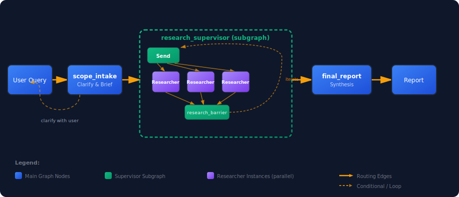

# Deep Research

A LangGraph multi-agent system that takes a research question, clarifies it if needed, fans out parallel web researchers, and pulls it all together into a cited report.

<p align="center">
  
</p>

## Getting started

```bash
git clone https://github.com/Hmbown/deepresearch.git
cd deepresearch
pip install -e .
cp .env.example .env   # add your OPENAI_API_KEY here
deepresearch "your research question"
```

You'll need **Python 3.11+** and an **OpenAI API key**. By default, search uses OpenAI's built-in `web_search` tool in the Responses API. Tavily/Exa are optional alternatives.

## Design walkthrough

See [DESIGN.md](DESIGN.md) for a walkthrough of the thought process behind the architecture — what worked, what didn't, and why.

## How it works

The pipeline has three stages:

1. **scope_intake** — figures out what you're actually asking. If the question is vague, it asks for clarification before doing any research.
2. **research_supervisor** — breaks the question into parallel research tracks, dispatches deep-agent researchers via LangGraph `Send`, waits at a barrier, then decides whether to iterate or move on. Researchers use compact-context continuation (`use_previous_response_id`) on OpenAI models to keep long tool traces efficient.
3. **final_report** — takes all the collected evidence and notes and synthesizes a report with citations.

## Configuration

Copy the example env file and fill in your keys:

```bash
cp .env.example .env
```

Check that everything works:

```bash
deepresearch --preflight
```

If you have LangSmith set up, you can verify tracing too:

```bash
deepresearch --preflight my-langsmith-project
```

## Usage

### CLI

```bash
deepresearch "your research question"
```

### Without web search

If you don't have search API credits or just want to test the pipeline:

```bash
SEARCH_PROVIDER=none deepresearch "key differences between Python 3.11 and 3.12"
```

### Use Exa or Tavily instead of OpenAI web search

```bash
SEARCH_PROVIDER=exa deepresearch "your research question"
# or
SEARCH_PROVIDER=tavily deepresearch "your research question"
```

### LangGraph Studio

Spin up the dev server and open it in Studio:

```bash
uvx --refresh --from "langgraph-cli[inmem]" --with-editable . --python 3.11 \
  langgraph dev --host 127.0.0.1 --port 2024 --no-browser --allow-blocking
```

Then go to: `https://smith.langchain.com/studio/?baseUrl=http://127.0.0.1:2024`

<details>
<summary>What it looks like in Studio</summary>


</details>

## Sample output

<details>
<summary><strong>Query:</strong> "Find data and evidence to support or refute the hypothesis that an airport handling an annual passenger throughput of 500,000 (five hundred thousand) can generate significant and measurable socioeconomic impacts on its surrounding region."</summary>

### Summary (answer to hypothesis)
Yes—**an airport around ~500,000 passengers/year can generate significant and measurable socioeconomic impacts**, but the **best empirical literature finds effects are (i) heterogeneous, (ii) often small in aggregate at this scale, and (iii) frequently hard to attribute causally** because economic growth also drives air traffic ("reverse causality"). Europe-wide econometrics shows **small airports (<1m pax/year) have much smaller long‑run GDP-per-capita effects from accessibility than large airports**, and causality often runs from growth to accessibility for smaller airports. At the same time, **place-based impact studies** and several **route/airport shock designs** show that in **remote/tourism-dependent regions** even sub‑1m airports can support **measurable jobs, GDP/GVA/output, and visitor spend**, though these "economic impact" studies are typically **gross supported activity** rather than **net additional** welfare.

---

### 1) What "significant and measurable socioeconomic impacts" means in the literature
#### Impact channels (definitions used in practice)
A standard airport-impact taxonomy distinguishes: **direct, indirect, induced, and catalytic** impacts. Direct/indirect/induced are typically quantified using input–output multipliers; catalytic refers to broader enabling effects via connectivity (trade, tourism, productivity, investment) and is methodologically harder to attribute. This framing is widely used in airport impact practice and guidance documents. [1], [2], [3]

#### What is "measurable" (typical metrics)
Common reported metrics include: **jobs (headcount or FTE), payroll/earnings, output, and value added (GDP/GVA)**. Many airport studies also quantify **visitor spending** and sometimes **productivity, firm outcomes, or property values** (more often in academic "catalytic" studies). [4], [5]

#### What counts as "significant"
Two distinct notions:
- **Statistical significance** (econometrics): detectable changes in outcomes attributable to air connectivity/airports, usually requiring panel/event-study/IV designs and pre-trend checks.
- **Material/policy significance** (impact studies/appraisal): impacts large relative to the regional economy or large enough to change decisions (often reported as totals, multipliers, or benefit–cost ratios). [6], [7]

#### Critical comparability issues (especially important around ~500k pax)
- **Geography ("surrounding region")**: results depend on study area (airport boundary, municipality/county, metro/NUTS region, or travel-time catchment). Indirect/induced effects are mechanically larger in larger study areas. [3]
- **Passenger definition**: enplanements vs total terminal passengers; O&D vs transfer; calendar vs fiscal year. (See case table: Alaska reports enplanements separately; UK/Europe often report total terminal passengers.) [8]
- **Gross vs net additional**: many airport impact studies estimate gross supported activity, while wider-benefit literature cautions that some effects are displacement/redistribution or double-counted relative to standard user benefits. [6], [7]

---

### 2) Evidence that supports the hypothesis (positive/measurable impacts at ~200k–1m pax)

#### 2A) Peer-reviewed econometric evidence linking air traffic/connectivity to outcomes (generally positive but heterogeneous)
- **Europe (NUTS‑2, 2000–2018): small airports show positive but small long-run GDP-per-capita effects via accessibility.**
  Pot & Koster (J. Transport Geography, 2022) estimate a **long‑run elasticity of regional GDP per capita with respect to air accessibility of 0.106 overall**, but only **0.022 for "small airports" (<1m pax/year implied by their bins), vs 0.179 for large airports (>5m)**. This is direct quantitative evidence of **diminishing returns by airport size** consistent with "~500k pax airports can matter, but effects are modest on average." [9], [10], [11]

- **US metros: passenger traffic associated with service-sector employment (benchmark elasticity).**
  Brueckner (Urban Studies, 2003) reports (in the accessible abstract summary) that a **10% increase in passenger enplanements is associated with ~1% higher service-related employment**, and no effect on manufacturing/goods employment; the study reports controlling for reverse causality. This supports a plausible mechanism (connectivity → services), though it is not specific to small airports and is metro-scale. [12]

- **Firm-level "route openings" designs show real economic responses (investment/TFP).**
  Route-based quasi-experiments in the broader literature find that opening "relevant" airline routes can raise **plant investment and TFP** (firm outcomes rather than regional GDP), supporting the catalytic channel that connectivity changes can produce measurable real-economy effects. [13]

#### 2B) Airport-specific quantified "economic impact" cases in/near the ~500k band (measurable direct/indirect/visitor impacts)

- **Fairbanks International Airport (Alaska, USA)**
  Passenger throughput: **2023 enplaned passengers 546,451** (and deplaned 547,488) from Alaska DOT&PF's aviation statistics. [8]
  Economic impact (gross): Alaska DOT&PF's **2022 Economic Impact Report Summary** reports **3,287 jobs supported** and **$866 million total economic output**. [14]
  Interpretation: a ~500k-enplanement airport in a remote region can be associated with **large measurable supported activity**, but the estimate is not a causal DiD and not necessarily net of displacement. [14]

- **Gibraltar International Airport (Gibraltar)**
  Passenger throughput: **473,803 total passengers in 2023** (airport-published statistics). [15]
  Economic linkage evidence: Government statements explicitly tie aviation connectivity and seat capacity to **overnight tourism and the wider visitor economy** (qualitative, not a quantified impact model). [16]

- **Vágar Airport (Faroe Islands)**
  Passenger throughput: **431,079 passengers (2023)**. [17]
  Measurable socioeconomic metric: annual report reports **average full-time employees 68 (2023)** for the airport company. [18]

- **Inverness Airport (Scotland)** (above 500k but still sub‑1m; useful "small airport" example)
  Passenger throughput: **792,150 passengers in FY2023/24** (HIAL annual report). [19]
  Impact study (gross): Highlands and Islands Enterprise summary reports **748 FTE jobs supported**, including **~554 direct** jobs. [20]

---

### 3) Evidence that refutes or qualifies the hypothesis (limited/null effects; endogeneity; displacement)
#### 3A) Quasi-experimental findings of limited or no regional growth effects from regional airport expansions/openings
- **Germany: regional airport expansions show no positive local growth spillovers (DiD).**
  Breidenbach's work on German regional airport expansions concludes **no evidence of positive regional growth spillovers** from expansions. [21], [22]
  Relevance to ~500k pax: the research line defines "regional airports" using a **<1 million passengers** cutoff in a base year (upper bound). [23]

- **Norway: construction of regional airports—positive but statistically insignificant population/employment effects (DiD).**
  Tveter (Research in Transportation Economics, 2017) uses a DiD design around the 1970s rollout of regional airports; the abstract reports about **~5% higher population (1970–1980) in municipalities near airports**, but **not statistically significant**, and similarly imprecise for employment. [24]

#### 3B) Europe-wide evidence: small-airport accessibility effects are small and causality often runs the other way
Pot & Koster (2022) explicitly report:
- For most regions, **small/medium airports contribute limited accessibility** (once overlapping catchments are accounted for). [10]
- **Causality mainly runs from economic growth to air accessibility**, "especially considering smaller airports." [10]

#### 3C) Sectoral reallocation vs aggregate growth (limited net employment effects)
Instrumental-variables evidence (US) has been summarized as showing airports can shift **sectoral composition** (e.g., toward tradable services) with **little/no aggregate employment increase**. [25]

---

### 4) Magnitude and detectability: what the numbers imply around ~500k passengers/year
#### 4A) Interpreting the strongest size-specific econometric result (Europe)
Pot & Koster's **small-airport long-run GDPpc elasticity of 0.022** implies that even noticeable changes in "accessibility" may translate into **small percentage changes in GDP per capita** on average, and therefore may be:
- **statistically hard to detect** in small regions with noisy GDP/employment data,
- **easily dominated by other local factors** (industry shocks, housing constraints, surface transport, policy). [10]

#### 4B) Why some ~500k airports still show large "economic impact" totals
Large gross totals (jobs/output) in impact studies are most plausible when:
- the airport is a **critical connectivity node** for a remote region (few substitutes),
- the airport is a **tourism gateway** where visitor spend is attributed to air access,
- the study area is broad enough to retain indirect/induced spending. [3], [6]

---

### 5) Case table (airports near ~500k pax; definitions, regions, metrics)

| Airport / context | Passenger volume (year; definition) | "Region" definition used | Outcome metrics reported | Evidence type / method | Direction |
|---|---:|---|---|---|---|
| **Fairbanks (FAI), Alaska** | **546,451 enplaned (2023)** [8] | Not specified in summary | **3,287 jobs**, **$866m output** (2022) [14] | Government impact study (multiplier) | Supports measurable impacts |
| **Gibraltar (GIB)** | **473,803 total passengers (2023)** [15] | Territory-wide narrative | Qualitative link to tourism/visitor economy [16] | Official stats + government narrative | Supports plausibility |
| **Vágar (FAE), Faroe Islands** | **431,079 passengers (2023)** [17] | Company-level reporting | **68 avg FTE employees (2023)** [18] | Annual report (direct jobs only) | Supports measurable direct effects |
| **Inverness (INV), Scotland** | **792,150 total passengers (FY2023/24)** [19] | Impact study (not retrieved) | **748 FTE jobs supported; ~554 direct** [20] | Economic & social impact study summary | Supports |

---

### 6) Balanced conclusion
A defensible, literature-consistent statement is:

> A ~500k-passenger airport can generate **measurable** socioeconomic impacts (jobs, output/GVA, tourism spend, accessibility benefits), but whether these are **significant** (econometrically detectable and net additional) depends strongly on **context (remoteness/tourism/industrial structure), substitution (nearby airports), and evaluation method (gross impact accounting vs causal inference)**. [3], [6], [10], [21], [24]

---

### Sources
[1] https://trid.trb.org/View/696670
[2] https://www.iata.org/en/services/consulting/economics/economic-impact-studies/
[3] https://nap.nationalacademies.org/read/27227/chapter/11
[4] https://airportscouncil.org/intelligence/economic-impact-study/
[5] https://www.faa.gov/2024-economic-impact-report.pdf
[6] https://www.oecd.org/content/dam/oecd/en/publications/reports/2007/12/the-wider-economic-benefits-of-transportation_g17a1b8c/234804032336.pdf
[7] https://www.bea.gov/index.php/resources/methodologies/RIMSII-user-guide
[8] https://internal.alaskaasp.com/Facilities/Default.aspx?id=218&siteid=50219.%2AA&tab=stats
[9] https://www.sciencedirect.com/science/article/pii/S096669232100315X
[10] https://research.rug.nl/en/publications/small-airports-runways-to-regional-economic-growth/
[11] https://trid.trb.org/View/1901236
[12] https://its.uci.edu/research_products/published-journal-article-airline-traffic-and-urban-economic-development/
[13] https://academic.oup.com/qje/article/128/2/861/1941581
[14] https://dot.alaska.gov/faiiap/pdfs/FAI-Economic-Impact-Report-Summary-2022.pdf
[15] https://www.gibraltarairport.gi/uploads/air-traffic-statistics/2023-air-traffic-statistics.pdf
[16] https://www.gibraltar.gov.gi/press-releases/the-budget-2023-minister-for-business-tourism-and-the-port-4652023-9043
[17] https://www.fae.fo/fo/um-vaga-floghavn/tidindi/vaga-floghavn-3-9-millionir-i-avlopi-fyri-2023
[18] https://fae2.cdn.fo/savn/gqugptxs/arsfrasoegn-2023.pdf?s=VXUVleNOGYHaeHhBLHECgLl7eVo
[19] https://www.hial.co.uk/downloads/file/904/hial-annual-report-and-accounts-2023-2024
[20] https://www.hie.co.uk/latest-news/2018/september/11/study-reveals-impacts-of-inverness-airport/
[21] https://www-sre.wu.ac.at/ersa/ersaconfs/ersa15/e150825aFinal01196.pdf
[22] https://ideas.repec.org/a/zbw/espost/225046.html
[23] https://www.econstor.eu/bitstream/10419/110340/1/825608074.pdf
[24] https://econpapers.repec.org/article/eeeretrec/v_3a63_3ay_3a2017_3ai_3ac_3ap_3a50-58.htm
[25] https://ideas.repec.org/p/hal/journl/hal-01463112.html

</details>

## Project structure

| Module | What it does |
|---|---|
| `graph.py` | Wires the three pipeline stages together |
| `state.py` | Shared state, Pydantic schemas, helpers |
| `intake.py` | Clarification + brief generation with Command routing |
| `supervisor_subgraph.py` | Parallel research dispatch and iteration loop |
| `researcher_subgraph.py` | Deep-agent researcher (`create_deep_agent`) with search/fetch/think tools |
| `report.py` | Report synthesis with retries and source citations |
| `nodes.py` | Tool implementations — search, fetch (SSRF-protected), think |
| `prompts.py` | All prompt templates (single canonical researcher prompt) |
| `config.py` | Model, search provider, and OpenAI Responses API config |
| `env.py` | Env bootstrap and preflight checks |
| `runtime_utils.py` | Runnable invocation helpers |
| `message_utils.py` | Message content extraction helpers |
| `cli.py` | CLI with streaming progress display |
| `evals/` | LLM-as-judge evaluation framework |

## LangSmith tracing

Add these to your `.env`:

```
LANGCHAIN_TRACING_V2=true
LANGCHAIN_API_KEY=<your-langsmith-api-key>
LANGCHAIN_PROJECT=deepresearch-local
```
